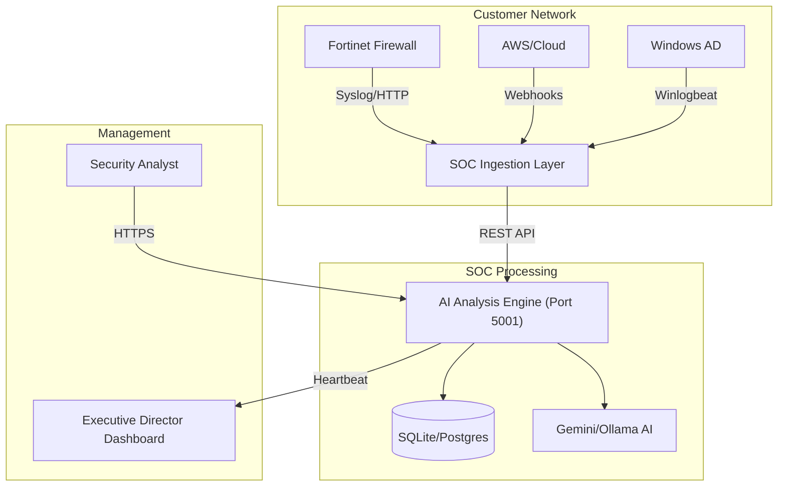

# 🌍 Enterprise AI SOC: Deployment & Ingestion Guide

This document provides technical instructions for deploying the CCL Guard AI SOC platform in a customer environment and configuring log ingestion for multi-vendor security stacks (specifically Fortinet).

## 1. System Requirements

| Component | Minimum Requirement | Recommended |
| :--- | :--- | :--- |
| **Processor** | 4-Core CPU | 8-Core CPU (for AI inference) |
| **Memory** | 8GB RAM | 16GB RAM |
| **Storage** | 100GB SSD | 500GB NVMe (High IOPs for logs) |
| **OS** | Ubuntu 22.04 LTS | RHEL 9 / Debian 12 |
| **Network** | Port 5001 (Client), Port 514 (Syslog) | Private VLAN for Ingestion |

---

## 2. Deployment Architecture



---

## 3. Installation Steps

### Step 1: Clone & Environment Setup
```bash
git clone https://github.com/falconblackburn/CCL-GUARD.git
cd CCL-GUARD
chmod +x setup_docker.sh
./setup_docker.sh
```

### Step 2: Configure Secrets
Create a `.env` file in the root directory:
```env
FLASK_SECRET_KEY=your_secure_random_key
GEMINI_API_KEY=your_google_ai_key
DIRECTOR_URL=https://your-director-instance.com
```

### Step 3: Start Services
```bash
docker-compose up -d
```

---

## 4. Ingesting Fortinet Logs

To pipe live logs from a **FortiGate Next-Generation Firewall** to the AI SOC:

### Option A: Syslog (Legacy Ingest)
1. Log into your FortiGate CLI or Web UI.
2. Navigate to **Log & Report > Log Settings**.
3. Enable **Send Logs to Syslog**.
4. Set IP to the SOC Server IP and Port to `514`.
5. Ensure the SOC Ingestion script is running: `python3 remote_ingest_worker.py --port 514`

### Option B: HTTP Webhook (Recommended)
1. On the FortiGate, go to **Security Fabric > Automation**.
2. Create a new **Stitch**.
3. **Trigger**: Any Event / High Severity Alert.
4. **Action**: Generic Webhook.
5. **URL**: `http://<SOC_IP>:5001/api/v2/ingest`
6. **Body**: 
```json
{
  "source": "Fortinet_KV",
  "log": "%%log%%"
}
```

---

## 5. AI Engine Configuration

### Enabling Local Heuristics (Privacy Mode)
If the customer environment is air-gapped or restricted from cloud AI:
1. Set `USE_AI=false` in `.env`.
2. The system will automatically use the **High-Fidelity Heuristic Engine** for all analyses.

### Enabling Deep AI Analysis
1. Set `USE_AI=true` and provide a `GEMINI_API_KEY`.
2. For local GPU processing, install **Ollama** and set `OLLAMA_MODEL=llama3`.

---

## 6. Troubleshooting
- **Logs not appearing**: Check if Port 514 is open in the local firewall (`ufw allow 514/udp`).
- **AI Analysis empty**: Verify the `GEMINI_API_KEY` is valid via `curl`.
- **Map data empty**: Ensure there are **Open** incidents. The threat map specifically visualizes active threats.

---

> [!IMPORTANT]
> **Data Privacy**: No raw log data leaves the customer environment except for the specific text fragments sent to the AI for analysis (if Cloud AI is enabled). For maximum privacy, we recommend the **Ollama** local model deployment.
